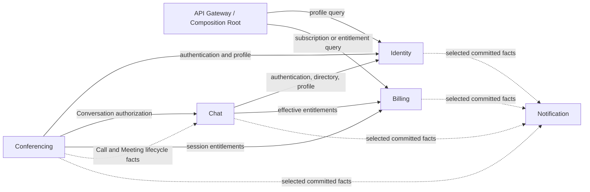

# Context Map

Status: Accepted target architecture  
Last reviewed: 2026-08-07

## Purpose

This document maps Huddle's bounded-context ownership and cross-context relationships.

It answers:

- which Context owns a business capability;
- which Context consumes another Context's public capability;
- whether an interaction is synchronous or asynchronous;
- where logical bidirectional collaboration exists;
- which dependency directions must not become library cycles.

It does not define domain lifecycle rules, DTO fields, event payloads, or delivery-phase timing.

Current implementation status belongs to:

`delivery/status.md`

The general integration pattern belongs to ADR 0004.

## Bounded Contexts

Huddle contains five bounded contexts:

| Context      | Primary ownership                                                                                                       |
| ------------ | ----------------------------------------------------------------------------------------------------------------------- |
| Identity     | User identity, credentials, OAuth identities, verification, authentication capabilities, minimal public identity facts  |
| Chat         | Contacts, Conversations, membership, Group administration, Messages, Meeting Conversation projections, timeline entries |
| Conferencing | Calls, Meetings, ConferenceSessions, participant media lifecycle, signaling authorization, media coordination           |
| Billing      | BillingAccount, paid Subscription, effective entitlements, Stripe integration                                           |
| Notification | Notifications, delivery attempts, channel integrations, Notification-specific consumption and retry                     |

Detailed ownership belongs to each Context document.

Storing another Context's identifier does not transfer ownership.

Examples:

- Billing storing `userId` does not make Billing an owner of Identity;
- Chat storing `senderId` does not make Chat an owner of Identity;
- Conferencing storing `conversationId` does not make Conferencing an owner of Chat;
- Chat storing `meetingId` does not make Chat an owner of Meeting.

## Relationship Map



Solid arrows represent synchronous public-capability use.

Dashed arrows represent asynchronous Integration Events.

The arrows show logical runtime relationships. They do not authorize imports of another Context's internal library layers.

Relationships shown in the accepted target may not yet be implemented. Consult `delivery/status.md` and the active Phase file before implementing them.

## Synchronous Relationships

| Consumer     | Provider | Capability category                      | Provider remains authoritative for           |
| ------------ | -------- | ---------------------------------------- | -------------------------------------------- |
| API Gateway  | Identity | Current-user profile view                | Identity profile facts                       |
| API Gateway  | Billing  | Current subscription or entitlement view | Billing state and effective entitlement      |
| Chat         | Identity | Authentication verification              | Authentication result                        |
| Chat         | Identity | Directory existence                      | User existence                               |
| Chat         | Identity | Minimal profile query                    | Public profile facts                         |
| Chat         | Billing  | Effective entitlements                   | Entitlement result                           |
| Conferencing | Identity | Authentication verification              | Authentication result                        |
| Conferencing | Identity | Minimal profile query                    | Public profile facts                         |
| Conferencing | Chat     | Conversation access facts                | Conversation membership and Call eligibility |
| Conferencing | Billing  | Effective entitlements                   | Session capability and numeric limit         |

For every synchronous relationship:

- the consumer owns its port;
- the provider owns its public application API;
- a composition-root adapter connects them;
- the consumer owns its resource authorization and mutation;
- provider entities and repositories remain private.

Detailed rules belong to ADR 0004 and the participating Context documents.

## Asynchronous Relationships

| Provider     | Consumer     | Fact category                            | Consumer-owned result                      |
| ------------ | ------------ | ---------------------------------------- | ------------------------------------------ |
| Conferencing | Chat         | Call lifecycle                           | Conversation timeline projection           |
| Conferencing | Chat         | Meeting lifecycle and eligibility        | Meeting Conversation and access projection |
| Identity     | Notification | Selected committed Identity facts        | Notification creation and delivery         |
| Chat         | Notification | Selected committed Chat facts            | Notification creation and delivery         |
| Conferencing | Notification | Selected committed Call or Meeting facts | Notification creation and delivery         |
| Billing      | Notification | Selected committed Billing facts         | Notification creation and delivery         |

Asynchronous relationships are introduced only when the consumer is part of an authorized delivery phase.

A row in this target map does not by itself authorize:

- an Outbox;
- an event broker;
- a producer Integration Event;
- a consumer projection.

The active Phase file determines when the relationship may be implemented.

Provider and consumer responsibilities follow ADR 0004.

## Gateway Composition

The API Gateway is an application composition root, not a bounded context.

It may combine multiple Context-owned views when no single Context owns the complete response.

For example:

```text
Current-user response
├─ Identity profile view
└─ Billing subscription or entitlement view
```

The Gateway owns:

- the combined response;
- provider invocation;
- endpoint-level failure policy;
- adapter wiring.

It does not own:

- Identity profile facts;
- effective-tier calculation;
- Subscription state;
- Context repositories.

A composite endpoint's availability coupling does not transfer domain ownership between its providers.

## Chat and Conferencing Collaboration

Chat and Conferencing have a logical relationship in both directions:

```text
Conferencing
→ synchronously consumes Chat Conversation authorization

Conferencing
→ asynchronously publishes lifecycle facts
→ Chat consumes them as projections
```

This collaboration must not become:

```text
libs/chat imports libs/conferencing
and
libs/conferencing imports libs/chat
```

The permitted boundary is:

- Conferencing owns the Conversation-access port it consumes;
- Chat owns the public Conversation-access API it provides;
- Conferencing owns its Integration Event contracts;
- Chat owns its timeline and Meeting Conversation application commands;
- the composition root supplies the adapters.

Neither Context imports the other's repositories, aggregates, persistence entities, or internal application services.

## Authorization Ownership

A provider may supply a fact without owning the consumer's authorization decision.

Examples:

- Identity confirms that a target user exists; Chat decides Contact or Conversation authorization.
- Billing supplies an entitlement; Chat decides whether a Group mutation is allowed.
- Billing supplies a numeric limit; Conferencing decides whether a session may be created.
- Chat supplies Conversation membership facts; Conferencing decides whether the requested Call operation is valid.

Authentication, existence, entitlement, and authorization are separate capabilities.

## External-System Boundaries

The following are external systems, not Huddle bounded contexts:

| External system     | Owning Context                                                                           |
| ------------------- | ---------------------------------------------------------------------------------------- |
| Google OAuth        | Identity                                                                                 |
| GitHub OAuth        | Identity                                                                                 |
| Stripe              | Billing                                                                                  |
| Email provider      | Identity for authentication-critical Email; product-event Notification Email is deferred |
| Slack               | Notification                                                                             |
| Browser WebRTC peer | Conferencing                                                                             |
| coturn              | Conferencing                                                                             |
| mediasoup runtime   | Conferencing                                                                             |

External provider objects do not become shared Huddle domain models.

The owning Context translates provider-specific behavior through its infrastructure boundary.

## Future Service Extraction

If a Context is extracted:

- consumer-owned ports remain conceptually stable;
- composition adapters change transport;
- provider public APIs become service contracts;
- Integration Events gain an external transport;
- persistence ownership remains unchanged;
- cross-service database access remains prohibited.

A stored external identifier is not, by itself, a reason for a synchronous service dependency.

Service extraction requires a separate operational and architectural decision.

## Prohibited Relationships

Do not introduce:

- cross-context repository injection;
- cross-context ORM relations;
- cross-context database joins;
- shared mutable aggregates;
- controllers importing another Context's repository;
- Context libraries importing another Context's internal layers;
- internal Domain Events used directly as public contracts;
- Redis as the only durable record of cross-context work;
- distributed transactions across Contexts.

Security-specific prohibitions belong to `architecture/security.md`.

## Sources of Truth

This document is the source of truth for:

- bounded-context relationship direction;
- synchronous versus asynchronous relationship type;
- provider and consumer pairing;
- Gateway composition responsibility;
- logical bidirectional collaboration;
- Context-cycle prevention.

Detailed behavior belongs to:

- Integration pattern: [`../decisions/0004-cross-context-integration.md`](../decisions/0004-cross-context-integration.md)
- System structure: [`system.md`](system.md)
- Data consistency: [`data-and-consistency.md`](data-and-consistency.md)
- Identity: [`../contexts/identity.md`](../contexts/identity.md)
- Chat: [`../contexts/chat.md`](../contexts/chat.md)
- Conferencing: [`../contexts/conferencing/README.md`](../contexts/conferencing/README.md)
- Billing: [`../contexts/billing.md`](../contexts/billing.md)
- Notification: [`../contexts/notification.md`](../contexts/notification.md)
- Current delivery status: [`../delivery/status.md`](../delivery/status.md)

DTO fields and event payloads belong in `contracts/`.
