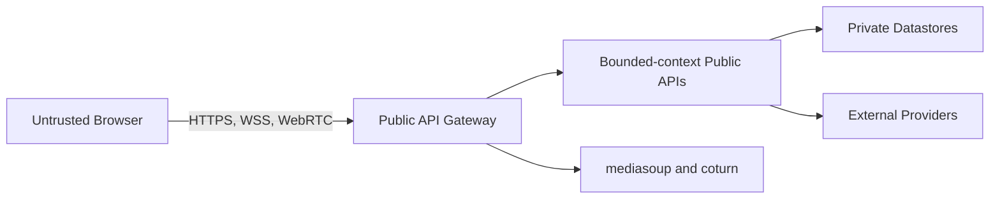

# Security Architecture

Status: Accepted target architecture  
Last reviewed: 2026-08-07

## Purpose

This document defines Huddle's system-wide security boundaries and shared security principles.

It applies across:

- HTTP;
- realtime connections;
- bounded-context integration;
- persistence;
- external providers;
- media infrastructure;
- deployment.

This document does not define each Context's authorization matrix or exact transport contract.

It is a security design baseline, not a claim that Huddle has completed a formal security audit or penetration test.

## Security Ownership

| Concern                                   | Authoritative source       |
| ----------------------------------------- | -------------------------- |
| System-wide trust and security principles | This document              |
| Identity and authentication behavior      | `contexts/identity.md`     |
| Chat authorization                        | `contexts/chat.md`         |
| Call and Meeting authorization            | `contexts/conferencing/`   |
| Billing and Stripe behavior               | `contexts/billing.md`      |
| Notification and Slack behavior           | `contexts/notification.md` |
| Exact HTTP and realtime payloads          | `contracts/`               |
| Exact deployment exposure and secrets     | `operations/`              |
| Executable enforcement                    | Source code and tests      |

Context documents may make their rules stricter but must not weaken this system-wide baseline.

## Security Principles

Huddle follows these principles:

1. Treat every client and external payload as untrusted.
2. Derive actor identity only from verified authentication material.
3. Enforce authorization on the backend.
4. Separate identity existence from resource authorization.
5. Apply least privilege across contexts, processes, and infrastructure.
6. Expose minimal data across context boundaries.
7. Fail closed for authentication, authorization, and entitlement-protected mutations.
8. Keep secrets outside source control and client bundles.
9. Persist authoritative state before reporting durable success.
10. Avoid logging secrets or private content.
11. Keep datastores and internal services off the public network.
12. Test failure and abuse paths, not only successful flows.

## Trust Boundaries



Trust does not automatically cross a boundary.

Each transition must independently validate:

- authentication;
- authorization;
- input shape;
- resource ownership;
- expected provider behavior;
- failure outcome.

## Client Trust Model

The frontend controls presentation and user interaction.

It is not authoritative for:

- user or sender identity;
- Contact or Conversation membership;
- Group ownership or administration;
- Call or Meeting participation;
- Meeting role or admission;
- subscription tier;
- entitlement values;
- participant capacity;
- payment completion;
- Notification recipient;
- server timestamps;
- lifecycle state.

Hidden buttons, disabled controls, and client-side route guards improve user experience but do not provide authorization.

## Authentication Boundary

Identity owns authentication.

A verified principal contains only claims required by consuming use cases, such as:

- stable user identifier;
- token identifier when required;
- issued time;
- expiration time;
- explicitly accepted authentication claims.

Token verification includes the applicable:

- signature;
- expiration;
- issuer;
- audience;
- token type;
- required claims;
- implemented revocation or rotation behavior.

Arbitrary decoded token content is not a trusted principal.

Authentication proves who the requester is. It does not grant access to a specific Chat, Call, Meeting, Billing, or Notification resource.

## Credential and OAuth Security

Credentials remain inside Identity.

Required system rules include:

- passwords are never stored in plaintext;
- password hashes do not cross the Identity boundary;
- passwords and tokens do not appear in logs;
- authentication input is validated;
- abuse-sensitive endpoints are rate-limited;
- authentication errors avoid unnecessary account enumeration;
- OAuth state and callback configuration are validated;
- OAuth client secrets remain server-side;
- provider identities are correlated safely;
- provider access tokens do not cross bounded-context boundaries.

Google and GitHub login are social authentication integrations.

They are not SAML Enterprise SSO or Workspace identity federation.

Detailed Identity behavior belongs to [`../contexts/identity.md`](../contexts/identity.md).

## Email Verification

Email-verification tokens must be:

- unpredictable;
- time-bounded;
- single-purpose;
- invalid after successful use;
- excluded from logs.

Authentication-critical email delivery must not move out of Identity without an explicit security and ownership decision.

## HTTP Authentication

Every public HTTP endpoint explicitly belongs to one category:

- public;
- authenticated;
- authenticated with resource authorization;
- external-provider callback with provider verification.

Authenticated routes obtain the requester from trusted server state.

A request body must not provide the authoritative actor `userId`.

A client-supplied target identifier remains untrusted input and is validated according to the use case.

## Realtime Authentication

Socket.IO authentication uses:

```text
handshake.auth.accessToken
```

Access tokens must not be supplied through the query string.

The accepted connection sequence is:

1. read the token from the authentication payload;
2. verify it through the configured Identity capability;
3. attach the trusted principal to socket state;
4. reject invalid authentication;
5. disconnect when the token expires;
6. refresh through HTTP and reconnect with a new token.

Realtime event payloads must not provide the authoritative actor identity.

## Realtime Authorization

Authentication at connection time does not authorize every later event.

Each protected realtime operation checks the current authorization owned by the relevant Context.

Joining a Socket.IO room is not itself proof of continuing authorization.

Realtime access must be removed or invalidated when underlying authorization changes.

Exact Chat and Conferencing authorization belongs to:

- [`../contexts/chat.md`](../contexts/chat.md)
- [`../contexts/conferencing/README.md`](../contexts/conferencing/README.md)
- [`../contexts/conferencing/calls.md`](../contexts/conferencing/calls.md)
- [`../contexts/conferencing/meetings.md`](../contexts/conferencing/meetings.md)

## Actor Identity

For an authenticated command:

```text
actorId = verified principal userId
```

Do not use:

```text
actorId = request or event payload userId
```

A client-supplied target user identifier may be valid input, but it never becomes the authenticated actor.

## Existence and Authorization

Identity may confirm that a user identifier exists.

Identity does not decide whether that user may access another Context's resource.

Authorization belongs to the Context that owns the protected resource.

The authenticated principal does not require a redundant Identity existence lookup.

Existence lookup is used primarily for untrusted target identifiers supplied by the client.

## Context-Boundary Security

Cross-context integration follows ADR 0004.

Public application APIs expose minimal capabilities and DTOs.

They must not expose:

- credentials;
- password hashes;
- OAuth links or tokens;
- refresh-token data;
- raw Stripe objects;
- Stripe webhook payloads;
- Slack access tokens;
- internal repositories;
- domain aggregates;
- ORM entities.

A Context must not bypass another Context's public capability by reading its tables or importing internal infrastructure.

An identifier shared across Contexts does not transfer aggregate ownership.

## Input Validation

Every external command validates the properties required by its contract, including applicable:

- required fields;
- type;
- length;
- normalization;
- supported enum values;
- identifier format;
- collection size;
- payload size;
- unsupported fields;
- nested payload shape.

Batch inputs require explicit upper bounds.

Validation does not replace domain invariants or authorization.

## Output Minimization

Responses contain only data required by the caller.

Examples include:

- presentation queries expose minimal public profile fields;
- Chat does not receive Identity credentials;
- entitlement consumers do not receive Stripe objects;
- Notification events do not contain provider aggregates;
- TURN credentials are short-lived and scoped.

The frontend decides how safe presentation data is displayed.

## Browser Security

### CORS and Origin Policy

The deployed environment uses an explicit frontend-origin allowlist.

Do not use unrestricted credentialed CORS.

Configuration distinguishes:

- local development;
- automated tests;
- Portfolio deployment.

WebSocket origins require explicit review separate from ordinary HTTP CORS.

Reverse-proxy headers are trusted only from the configured proxy boundary.

### CSRF

CSRF protection depends on authentication transport.

If credentials use cookies:

- use appropriate `HttpOnly`, `Secure`, and `SameSite` settings;
- document protection for state-changing requests;
- restrict cross-origin credential behavior.

If access tokens use an Authorization header:

- protect token storage from script access;
- keep CORS restricted;
- treat XSS as a critical threat.

The selected token transport belongs to Identity and the HTTP contracts.

### User-Controlled Content

User-controlled values include:

- display names;
- Group names;
- Meeting titles;
- Messages;
- Notification summaries.

Treat stored text as untrusted when rendering.

Do not render arbitrary HTML by default.

Rich-text support requires a separate sanitization policy.

Private Message content must not be copied indiscriminately into logs or external-channel diagnostics.

## Persistence Security

Datastores must:

- remain private to the deployment network;
- use least-privilege application credentials;
- use parameterized queries or safe binding;
- validate document and payload shape;
- translate infrastructure errors before client exposure;
- protect backups;
- separate local, test, and deployed credentials.

Context persistence ownership remains enforced even when Contexts share a database server.

MongoDB document flexibility does not remove schema-validation requirements.

## Redis Security

Redis must:

- remain private;
- use protected access where supported;
- use namespaced keys;
- avoid unnecessary long-lived secrets;
- never become the sole copy of durable business state;
- reject client-controlled raw key or command construction.

Redis restart or loss must not permanently erase accepted Billing, Notification, or Integration Event work.

## External Provider Security

External-provider payloads remain untrusted even after transport-level verification.

| Provider category        | Required boundary                                                                   |
| ------------------------ | ----------------------------------------------------------------------------------- |
| OAuth provider           | State, callback, provider identity, and server-side secret validation               |
| Stripe Checkout          | Authenticated ownership and server-controlled product configuration                 |
| Stripe webhook           | Raw-body signature verification, durable receipt, deduplication, and reconciliation |
| Slack OAuth and delivery | Protected credentials, validated callback state, authorized destination             |
| Email provider           | Minimal content, protected credentials, and safe failure handling                   |

Detailed provider rules belong to their owning Context documents.

A successful browser redirect is never authoritative proof of payment or provider-side completion.

## Entitlement Security

Protected mutations must fail closed when the effective entitlement cannot be determined.

The system must not:

- trust a client-provided tier;
- trust a client-provided entitlement object;
- treat Billing failure as confirmed absence;
- assume Pro;
- mutate protected state before entitlement resolution.

Confirmed absence of paid Billing data may produce synthesized Free only through Billing's documented domain behavior.

Detailed entitlement behavior belongs to [`../contexts/billing.md`](../contexts/billing.md).

## Media Security

Signaling and media operations require:

- authenticated principal;
- current Call or Meeting authorization;
- active session;
- participant eligibility;
- resource ownership;
- capacity availability;
- supported operation and payload.

Media identifiers must be scoped to the authenticated participant and session.

A client must not control another participant's transport, Producer, Consumer, or signaling destination without explicit authority.

TURN credentials must be:

- time-limited;
- generated server-side;
- derived from protected server material;
- issued only to eligible users;
- excluded from logs.

Detailed media behavior belongs to [`../contexts/conferencing/README.md`](../contexts/conferencing/README.md).

## Notification and External Delivery Security

Notification delivery must not grant access to the referenced resource.

The destination Context independently authorizes access when a user follows a Notification.

External delivery credentials must:

- remain server-side;
- be encrypted at rest where applicable;
- never be returned through public APIs;
- be excluded from logs.

Integration Event payloads contain only the minimum data required by Notification.

Detailed behavior belongs to [`../contexts/notification.md`](../contexts/notification.md).

## Secrets Management

Secrets include:

- database credentials;
- JWT signing material;
- OAuth client secrets;
- email-provider credentials;
- Stripe secrets;
- Slack secrets and tokens;
- TURN shared secrets;
- deployment credentials.

Required rules:

- secrets are not committed;
- example configuration contains names, not real values;
- secrets are not built into container images;
- secrets are not printed in CI or application logs;
- local, test, and Portfolio secrets are separate;
- rotation procedures are documented;
- leaked credentials are replaced, not merely removed from the latest commit.

## Logging and Diagnostics

Logs should contain safe diagnostic data such as:

- correlation identifier;
- Context;
- use case;
- safe resource identifier;
- error category;
- retry attempt;
- safe external-provider correlation identifier.

Logs must not contain:

- passwords;
- password hashes;
- access or refresh tokens;
- OAuth tokens;
- Stripe or Slack secrets;
- TURN shared secrets;
- full private Message content by default;
- sensitive webhook payloads.

Diagnostic usefulness does not justify indiscriminate payload logging.

## Network Exposure

The Portfolio deployment exposes only required public services.

Expected public categories include:

- HTTPS and WebSocket;
- restricted administrative access;
- required media ports;
- coturn listener and relay ports.

Do not expose:

- PostgreSQL;
- MongoDB;
- Redis;
- internal application ports;
- container-management APIs;
- debug endpoints.

Exact ports and firewall rules belong to [`../operations/deployment.md`](../operations/deployment.md).

## Abuse Controls

Prioritize rate limiting and abuse protection for:

- registration and login;
- verification resend;
- Contact requests and invitations;
- Message send;
- Call initiation;
- Meeting-link access;
- Checkout creation;
- external-provider callbacks where appropriate;
- Slack connection management;
- TURN credential issuance.

Rate limiting complements authentication, authorization, and validation. It does not replace them.

Exact limits require measurement and an accepted policy.

## Failure Responses

Security-sensitive responses balance usability with information minimization.

Internal error categories may remain distinct without exposing unnecessary:

- account existence;
- hidden resource existence;
- membership details;
- provider secrets;
- database structure;
- stack traces.

Exact HTTP and realtime error mappings belong to `contracts/`.

## Security Testing

Security-oriented tests include applicable:

- invalid and expired authentication;
- token-type confusion;
- actor spoofing;
- unauthorized resource access;
- unauthorized administration;
- unauthorized signaling or media control;
- Meeting-history boundary bypass;
- client-provided tier or price attempts;
- invalid provider signatures;
- duplicate external events;
- secret and credential exposure;
- TURN credential expiration;
- CORS rejection;
- log redaction;
- private datastore exposure.

Tests must cover denial and failure paths, not only successful authentication.

## Security Review Triggers

Review this document when:

- authentication transport changes;
- a new external provider is introduced;
- a new public endpoint or realtime namespace is added;
- a Context exposes a new public capability;
- file upload, recording, or rich text is introduced;
- deployment topology changes;
- a service is extracted;
- a security incident occurs;
- a major authentication dependency changes.

## Known Limits

The Portfolio architecture does not claim:

- formal penetration testing;
- compliance certification;
- hardware-backed secret management;
- multi-region security isolation;
- Enterprise identity governance;
- production security-operations coverage;
- production SLA.

These are explicit limits, not implied capabilities.

## Source-of-truth Boundaries

This document is the source of truth for:

- system-wide trust boundaries;
- authentication and authorization principles;
- realtime security principles;
- cross-context data minimization;
- external-provider security principles;
- secrets and logging rules;
- deployment network-security principles.

This document is not the source of truth for:

- Context-specific authorization matrices;
- exact endpoint guards;
- exact token payloads;
- exact CORS values;
- exact rate limits;
- exact firewall ports;
- secret values;
- provider SDK configuration.

Those concerns belong to Context documents, contracts, code, tests, and operations documentation.
