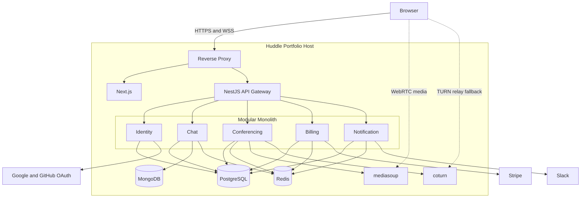

# System Architecture

Status: Accepted target architecture  
Last reviewed: 2026-08-07

## Purpose

This document describes Huddle's high-level runtime structure, primary technology components, application composition boundary, and deployment shape.

It answers:

- what runs in the Huddle system;
- how the major runtime components connect;
- where bounded contexts are hosted;
- which datastores and media components exist;
- how the current modular monolith may evolve.

It does not define:

- Context domain models;
- product tiers;
- lifecycle rules;
- API payloads;
- persistence schemas;
- phase acceptance criteria;
- deployment commands.

Current implementation status belongs only to:

[`../delivery/status.md`](../delivery/status.md)

## System Overview

Huddle is a backend-focused realtime communication platform built as a Domain-Driven Design modular monolith.

The primary stack is:

- NestJS backend;
- Next.js frontend;
- PostgreSQL;
- MongoDB;
- Redis;
- Socket.IO;
- WebRTC;
- mediasoup;
- coturn;
- Stripe.

The initial Portfolio deployment runs on one Linux host while preserving explicit bounded-context and persistence ownership.

## Runtime Topology



The diagram represents the accepted target structure.

It does not claim that every component is already implemented or deployed.

## Frontend

Next.js owns:

- user interaction;
- page and component state;
- API consumption;
- browser Socket.IO connections;
- browser WebRTC APIs;
- visual presentation;
- participant and Message layout;
- placeholder avatar presentation.

The frontend is not authoritative for:

- authenticated identity;
- authorization;
- resource membership;
- roles;
- entitlements;
- participant capacity;
- lifecycle transitions;
- payment state;
- durable timestamps.

Backend security principles are defined in [`security.md`](security.md).

## API Gateway and Composition Root

The NestJS API Gateway hosts and composes the bounded-context modules.

It owns:

- HTTP routing composition;
- realtime gateway composition;
- authentication adapter wiring;
- dependency-injection bindings;
- cross-context adapters;
- composed responses that belong to no single Context;
- application startup and shutdown coordination.

It does not own domain rules belonging to a bounded context.

For a response that combines multiple Context-owned views, the Gateway owns only the composition.

Example:

```text
Current-user response
├─ Identity profile capability
└─ Billing subscription or entitlement capability
```

Identity retains ownership of profile facts.

Billing retains ownership of Subscription and entitlement facts.

## Bounded-Context Libraries

Each bounded context is implemented as a library with its own applicable:

- domain model;
- application use cases;
- consumer-owned ports;
- infrastructure adapters;
- interface adapters;
- persistence mappings;
- public application capabilities.

"Applicable" does not require every bounded-context library to contain an HTTP
controller or to mirror another context's adapter folders. HTTP transport
placement follows the integration-boundary criteria in
[ADR 0008](../decisions/0008-place-http-transport-by-integration-boundary.md).

The bounded contexts are:

| Context      | Documentation                                                              |
| ------------ | -------------------------------------------------------------------------- |
| Identity     | [`../contexts/identity.md`](../contexts/identity.md)                       |
| Chat         | [`../contexts/chat.md`](../contexts/chat.md)                               |
| Conferencing | [`../contexts/conferencing/README.md`](../contexts/conferencing/README.md) |
| Billing      | [`../contexts/billing.md`](../contexts/billing.md)                         |
| Notification | [`../contexts/notification.md`](../contexts/notification.md)               |

Calls and Meetings are capabilities inside the Conferencing bounded context. They are not separate bounded contexts.

Cross-context relationship direction belongs to [`context-map.md`](context-map.md).

## Application Dependency Rules

A Context must not import another Context's:

- repository;
- aggregate;
- domain entity;
- ORM entity;
- internal application service;
- controller;
- infrastructure adapter.

Permitted cross-context communication uses:

- consumer-owned ports;
- provider-owned public APIs;
- composition-root adapters;
- provider-owned Integration Events.

The complete integration pattern belongs to ADR 0004.

## Runtime Communication

### HTTP

HTTP supports:

- public authentication endpoints;
- authenticated commands and queries;
- provider callbacks;
- composed application responses.

Exact endpoints and payloads belong to `contracts/http.md`.

### Realtime Application Events

Socket.IO supports authenticated realtime behavior for:

- Chat;
- Call signaling;
- Meeting coordination;
- Notification presentation where implemented.

Exact namespaces, event names, payloads, and acknowledgements belong to the relevant contract documents.

### Cross-Context Synchronous Calls

Current-state dependencies use in-process public application capabilities through composition adapters.

Examples include:

- identity verification;
- directory or profile queries;
- entitlement queries;
- Conversation authorization.

### Cross-Context Asynchronous Events

Committed facts with real asynchronous consumers use:

- provider-owned Transactional Outbox;
- versioned Integration Event;
- idempotent consumer;
- consumer-owned local update.

The general pattern belongs to ADR 0004 and [`data-and-consistency.md`](data-and-consistency.md).

## Data Services

### PostgreSQL

PostgreSQL stores Context-owned relational and transactional state.

Contexts may share one PostgreSQL server while retaining:

- owned tables or schemas;
- owned migrations;
- owned repositories;
- no cross-context ORM relations;
- no cross-context database joins.

### MongoDB

MongoDB stores Chat-owned append-oriented Conversation entries.

Its use is intentionally bounded rather than repository-wide.

The persistence decision belongs to ADR 0003.

### Redis

Huddle initially uses one Redis instance.

Redis supports recoverable runtime or operational state such as:

- Socket.IO presence;
- live participant presence;
- short-lived coordination;
- BullMQ queues;
- recoverable processing state.

Redis is not the sole source of durable business truth.

Detailed datastore and consistency rules belong to [`data-and-consistency.md`](data-and-consistency.md).

## Realtime Media

### Direct Calls

Direct Calls use peer-to-peer WebRTC where connectivity permits.

coturn provides relay fallback when direct connectivity fails.

The backend remains responsible for:

- authentication;
- authorization;
- signaling;
- durable Call lifecycle;
- TURN credential issuance.

### Group Calls and Meetings

Group Calls and standalone Meetings use mediasoup as an SFU.

The initial topology uses:

- one mediasoup Worker;
- one Router per active SFU-backed ConferenceSession;
- explicitly configured public network information;
- restricted media ports;
- no horizontal media-node routing.

Live mediasoup resources are process-bound.

The accepted architecture does not claim transparent recovery of active media after a media-process failure.

Detailed media design belongs to [`../contexts/conferencing/README.md`](../contexts/conferencing/README.md).

## External Systems

| External system | Owning boundary             |
| --------------- | --------------------------- |
| Google OAuth    | Identity                    |
| GitHub OAuth    | Identity                    |
| Stripe          | Billing                     |
| Slack           | Notification                |
| Browser WebRTC  | Conferencing                |
| mediasoup       | Conferencing infrastructure |
| coturn          | Conferencing infrastructure |

External-provider objects do not become shared Huddle domain entities.

Provider-specific behavior is translated inside the owning Context's infrastructure boundary.

## Deployment Model

The Portfolio deployment baseline is:

- one OCI Always Free Ampere A1 Linux host;
- Docker Compose;
- reverse proxy;
- Next.js;
- NestJS modular monolith;
- PostgreSQL;
- MongoDB;
- Redis;
- mediasoup;
- coturn.

This is a low-traffic Portfolio topology.

It is not a production high-availability deployment and carries no production SLA.

Render is not part of the baseline.

Exact topology, configuration, procedures, and recovery steps belong to:

- `operations/deployment.md`;
- `operations/runbook.md`;
- ADR 0007.

## Future Service Extraction

Huddle is not currently implemented as independently deployed microservices.

A Context may be considered for extraction only when a concrete need exists, such as:

- independent scaling;
- independent deployment;
- failure isolation;
- security isolation;
- team ownership;
- media-specific compute requirements.

After extraction:

- Context ownership remains unchanged;
- consumer ports remain conceptually stable;
- composition adapters change transport;
- provider APIs become service contracts;
- Integration Events use an external transport;
- each service owns its persistence;
- no service reads another service's database.

Kubernetes is not required merely because a service is extracted.

Extraction order is not predetermined and is not part of the current roadmap.

## Known Architectural Limits

The accepted Portfolio architecture intentionally includes:

- one deployment host;
- one modular-monolith backend deployment;
- one PostgreSQL server;
- one MongoDB deployment;
- one Redis instance;
- one mediasoup Worker;
- no active-media reconstruction;
- no multi-region availability;
- no Kubernetes;
- no independent Context deployment;
- Portfolio-scale operational expectations.

These limitations must not be presented as production-scale capability.

## Sources of Truth

This document is the source of truth for:

- high-level runtime topology;
- major runtime components;
- application composition root;
- high-level communication modes;
- high-level datastore placement;
- high-level media topology;
- deployment-model summary;
- future service-extraction constraints.

Detailed information belongs to:

- Context relationships: [`context-map.md`](context-map.md)
- Data consistency: [`data-and-consistency.md`](data-and-consistency.md)
- Security: [`security.md`](security.md)
- Product scope: [`../product/scope.md`](../product/scope.md)
- Delivery status: [`../delivery/status.md`](../delivery/status.md)
- Architecture decisions: [`../decisions/README.md`](../decisions/README.md)
- Deployment operations: `operations/deployment.md`
