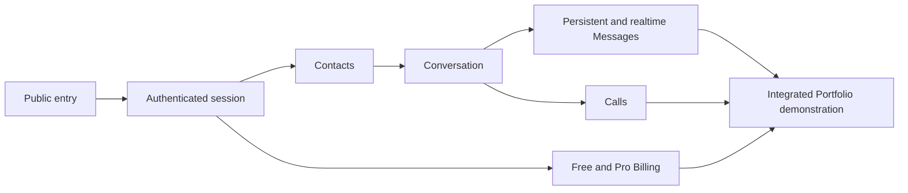

# User Experience

Status: Accepted target experience

Last reviewed: 2026-08-22

## Purpose

This document defines Huddle's cross-capability user experience.

It owns:

- experience positioning;
- the supported client surface;
- cross-capability journey relationships;
- high-level information architecture;
- shared user-interface state semantics;
- user-visible recovery and reconciliation principles;
- accessibility and responsive-experience principles;
- product-language consistency;
- source-of-truth routing for frontend work.

It does not define:

- committed or deferred product capabilities;
- delivery timing;
- current implementation status;
- Domain invariants;
- exact HTTP or realtime contracts;
- frontend component architecture;
- route paths;
- design tokens;
- high-fidelity screen layouts;
- the Portfolio demonstration script.

Accepted target experience is not evidence that a screen, route, interaction, or backend capability is implemented.

Current implementation state belongs to:

[`../delivery/status.md`](../delivery/status.md)

Delivery authorization belongs to:

- [`../delivery/roadmap.md`](../delivery/roadmap.md)
- the applicable file under [`../delivery/phases/`](../delivery/phases/)

## Experience Positioning

Huddle provides a portfolio-grade functional interface for operating, validating, and demonstrating its backend capabilities.

The experience prioritizes:

- clear user journeys;
- visible system state;
- honest asynchronous feedback;
- recoverable failure;
- consistent product terminology;
- keyboard-accessible operation;
- responsive use;
- demonstrable backend boundaries.

Huddle does not currently aim to demonstrate:

- a production-scale collaboration-suite design system;
- a complete brand system;
- extensive personalization;
- native mobile applications;
- comprehensive offline operation;
- a complete Progressive Web App experience;
- animation-led product presentation;
- pixel-level parity with commercial collaboration platforms.

Visual polish should support comprehension and demonstration without becoming a substitute for implemented product behavior.

## Supported Client Surface

The committed client surface is a responsive Next.js web application.

Communication and media workflows are desktop-first because they may require:

- persistent navigation;
- Conversation lists;
- Message history;
- participant controls;
- simultaneous primary and secondary content regions.

Core operations must remain usable on narrower screens.

Responsive behavior may change layout and navigation presentation, but it must not:

- remove required product behavior;
- weaken authorization;
- hide an unrecoverable state;
- make critical actions keyboard-inaccessible;
- treat mobile-width presentation as a separate product capability.

Native mobile applications, full offline support, and complete PWA behavior require separate Product Scope and delivery decisions.

## Experience Principles

### Server-Authoritative Behavior

The frontend controls presentation and interaction.

It is not authoritative for:

- authenticated identity;
- Contact or Conversation membership;
- roles or administrative authority;
- entitlements or quota values;
- payment completion;
- lifecycle transitions;
- durable timestamps;
- persistent Message acceptance;
- participant capacity.

Client-side route guards, hidden controls, and disabled controls improve usability but do not prove authorization.

Backend authority and trust boundaries belong to:

- [`../architecture/system.md`](../architecture/system.md)
- [`../architecture/security.md`](../architecture/security.md)

### Honest Asynchronous State

The interface must distinguish applicable:

- request not started;
- operation pending;
- operation confirmed;
- operation failed before acceptance;
- operation accepted but still reconciling;
- dependency unavailable;
- realtime disconnected;
- realtime reconnecting;
- durable state reloaded after reconnect.

The interface must not show durable success solely because:

- a button was pressed;
- a browser redirect completed;
- an optimistic local value exists;
- a realtime broadcast arrived;
- a payment provider returned the browser to Huddle.

### Recoverable Interaction

When recovery is possible, the interface should make the next safe action clear.

Applicable recovery actions include:

- correcting invalid input;
- retrying an idempotent operation;
- reauthenticating;
- reconnecting;
- reloading durable history;
- waiting for accepted asynchronous processing;
- returning to a stable resource list.

A retry must preserve the operation identity required by the owning contract.

The frontend must not invent retry behavior for operations whose idempotency or failure outcome is undefined.

### Reconciliation with Durable State

Realtime delivery improves immediacy but is not the durable source of truth.

After disconnection, late delivery, duplicate delivery, or uncertain acknowledgement, the client reconciles with the owning durable query or history contract.

For Messages, the target relationship is:

```text
local pending operation
→ server acceptance
→ persisted Message identity
→ realtime delivery
→ durable history reconciliation
```

Exact Message acknowledgements, identifiers, ordering, and reconnect behavior belong to:

[`../contracts/chat-realtime.md`](../contracts/chat-realtime.md)

### Capability Clarity

The interface must distinguish:

- available behavior;
- temporarily unavailable behavior;
- unavailable behavior caused by authorization or entitlement;
- behavior planned for a later Phase;
- behavior not included in Product Scope.

A future capability must not appear operable merely because a navigation seam or architectural extension point exists.

Ordinary users should not need to understand delivery Phase names, internal bounded contexts, or implementation status to operate the product.

### Progressive Disclosure

Navigation and controls expose only behavior available to the current implemented product surface.

The target information architecture may reserve conceptual areas for later capabilities, but implementation must not add empty or misleading destinations for future Phases.

Complex administrative actions should appear only in the resource and role context where they apply.

### Accessible Operation

The target experience supports:

- keyboard access to core operations;
- visible focus;
- semantic structure;
- meaningful control names;
- non-color-only status communication;
- understandable validation and failure messages;
- appropriate announcement of important asynchronous changes;
- motion that respects the accepted reduced-motion policy.

The exact accessibility conformance target and verification matrix must be selected before the first frontend implementation outcome.

### Product-Language Consistency

User-visible terminology follows the owning Product, Context, and Contract documents.

The interface must not create alternative terms that change Domain meaning.

Examples include preserving the distinction between:

- Contact and Conversation;
- Direct Conversation and Group Conversation;
- Call and Meeting;
- pending payment return and confirmed Pro entitlement;
- realtime delivery and durable Message history.

Presentation copy may be friendlier than internal class names, but it must preserve the same behavioral distinction.

## Information Architecture

The target experience is organized around user goals rather than bounded-context implementation structure.

### Public Experience

The public experience may provide:

- registration;
- Email verification;
- credential login;
- Google OAuth login;
- GitHub OAuth login.

Exact availability follows implemented Identity contracts.

Password recovery, profile editing, avatar upload, theme preferences, and other conventional account features are not implied unless Product Scope and a delivery Phase explicitly include them.

### Authenticated Application Shell

The authenticated shell provides applicable:

- primary navigation;
- current location and resource context;
- session state;
- logout;
- global dependency or connection status when user action is affected.

Session controls do not imply a complete Account settings area.

### Contacts

Contacts remain distinct from Conversations.

The experience may present:

- incoming Contact requests;
- outgoing Contact requests;
- accepted Contacts;
- Contact-related actions;
- an action to open or create the eligible Direct Conversation.

A Contact relationship does not automatically appear as an existing Conversation.

### Conversations

The Conversation experience may present:

- an authorized Conversation list;
- the selected Conversation;
- Message history;
- Message composition;
- membership or administrative controls where applicable;
- later Call entry points when their Phase is implemented.

Direct and Group Conversations remain visibly distinguishable where their behavior differs.

### Later Product Areas

Calling, Billing, Meetings, and Notification enter the user-visible application only through their authorized delivery Phases.

A high-level target area in this document does not authorize:

- an empty navigation destination;
- a placeholder control presented as available;
- early backend behavior;
- speculative transport contracts.

## Cross-Capability Journey

The first integrated Portfolio journey develops incrementally.



The diagram represents accepted journey relationships.

It does not claim that every node is implemented.

The authoritative delivery order remains in:

[`../delivery/roadmap.md`](../delivery/roadmap.md)

## Phase 2 Experience Boundary

Phase 2 establishes the frontend foundation required for Contacts and Chat.

Its user-visible target connects:

```text
Authentication
→ Contacts
→ Direct or Group Conversation
→ Message history
→ realtime Message delivery
→ reconnect and durable reconciliation
```

The active Phase owns the exact authorized subset:

[`../delivery/phases/02-chat.md`](../delivery/phases/02-chat.md)

This document does not duplicate the complete Phase 2 capability list.

### Authentication Transition

Phase 2 may expose the already-implemented Phase 1 Authentication behavior through the web application without reopening Phase 1 Domain scope.

Before an Authentication UI implementation outcome, the project must explicitly decide and document:

- browser access-token transport and storage;
- refresh-token transport, storage, and atomic rotation;
- OAuth callback handoff to the frontend;
- applicable cookie, CSRF, XSS, and CORS behavior;
- the user-visible treatment of transitional Email verification.

The currently implemented Identity contract includes transitional behavior.

See:

- [`../contracts/identity-http.md`](../contracts/identity-http.md)
- [`../architecture/security.md`](../architecture/security.md)

This UX document does not select a transport or redefine the Identity contract.

### Chat Contract Transition

Before a Phase 2 Chat UI consumes an HTTP capability:

- the stable shared error envelope must be accepted;
- the exact implemented Chat HTTP contract must exist;
- applicable pagination behavior must be defined;
- authorization and dependency failures must have stable public meaning.

See:

[`../contracts/http.md`](../contracts/http.md)

The interface must not infer an exact endpoint, error code, or pagination shape from a target journey.

## Shared State Semantics

| State                  | User-visible meaning                                 | Required behavior                                                            |
| ---------------------- | ---------------------------------------------------- | ---------------------------------------------------------------------------- |
| Initial loading        | Required data has not resolved                       | Preserve context where possible and avoid false empty state                  |
| Background refresh     | Existing data is being checked                       | Keep usable confirmed data unless the contract requires blocking             |
| Empty                  | The authoritative query succeeded with no items      | Explain the state and show an authorized next action where one exists        |
| Validation failure     | Input is not accepted                                | Identify correctable input without exposing internal structure               |
| Authentication failure | The session is absent, invalid, or expired           | Stop protected interaction and provide the accepted reauthentication path    |
| Authorization denial   | The actor cannot perform the operation               | Do not imply that hiding the control is enforcement                          |
| Missing resource       | The visible resource cannot be resolved              | Return the user to a stable authorized location                              |
| Dependency unavailable | Required server behavior cannot complete             | Preserve confirmed state and distinguish retryable unavailability            |
| Pending mutation       | The server result is not yet confirmed               | Prevent duplicate accidental submission while preserving safe retry identity |
| Confirmed mutation     | The authoritative operation succeeded                | Reconcile local presentation with the returned or queried state              |
| Failed mutation        | The operation did not produce confirmed success      | Do not display durable success; preserve recoverable user input where safe   |
| Disconnected           | Realtime delivery is unavailable                     | Keep durable content readable where designed and mark live state as stale    |
| Reconnecting           | The client is attempting to restore live delivery    | Avoid duplicate user commands and preserve known durable state               |
| Reconciled             | Durable state has been refreshed after uncertainty   | Remove stale pending or duplicate presentation                               |
| Removed resource       | A previously visible resource is no longer available | Explain the loss of access without leaking hidden state                      |

Exact status codes, payloads, acknowledgement shapes, and retry identities remain contract-owned.

## Optimistic Presentation

Optimistic presentation is permitted only when:

- the operation is reversible; or
- the contract supplies an explicit client-operation identity and reconciliation path;
- failure can be shown without losing user input or creating duplicate side effects;
- the server remains authoritative for the final state.

Optimistic presentation must not confirm:

- authentication;
- Contact acceptance;
- membership;
- administrative role;
- entitlement;
- payment completion;
- durable Message acceptance;
- Call or Meeting lifecycle completion

without the applicable authoritative result.

## Sensitive and User-Controlled Data

User-controlled text remains untrusted when rendered.

Applicable values include:

- display names;
- Group names;
- Meeting titles;
- Messages;
- Notification summaries.

The interface must not render arbitrary HTML by default.

The ordinary presentation surface must not expose:

- access tokens;
- refresh tokens;
- verification tokens;
- OAuth credentials;
- provider secrets;
- raw Stripe objects;
- internal infrastructure errors;
- hidden membership or resource details.

Detailed security rules belong to:

[`../architecture/security.md`](../architecture/security.md)

## Responsive Experience

Responsive design preserves the same authorized capability while changing layout.

The accepted baseline requires an explicit decision before implementation for:

- supported browsers;
- minimum narrow-screen behavior;
- navigation collapse behavior;
- Conversation list and active Conversation transitions;
- modal or drawer behavior;
- media-control layout;
- keyboard and focus behavior after layout changes.

A responsive implementation must not make core behavior available only through hover.

## Verification Expectations

Frontend verification follows:

[`../engineering/testing.md`](../engineering/testing.md)

Applicable evidence includes:

- pure presentation and formatting tests;
- component interaction tests;
- accessibility semantics;
- public-contract translation tests;
- authenticated browser journeys;
- realtime disconnect, reconnect, and reconciliation;
- responsive smoke checks.

Frontend verification complements rather than replaces:

- backend authorization tests;
- persistence integration tests;
- concurrency tests;
- provider validation;
- deployment validation;
- WebRTC and media evidence.

The exact Portfolio demonstration sequence belongs to:

[`../operations/portfolio-demo.md`](../operations/portfolio-demo.md)

## Source-of-Truth Boundaries

| Concern                                                 | Authoritative source                                                                                                      |
| ------------------------------------------------------- | ------------------------------------------------------------------------------------------------------------------------- |
| Committed, deferred, stretch, and non-goal capabilities | [`scope.md`](scope.md)                                                                                                    |
| Cross-capability user experience                        | This document                                                                                                             |
| Free and Pro values                                     | [`tiers.md`](tiers.md)                                                                                                    |
| Delivery order and phase status                         | [`../delivery/roadmap.md`](../delivery/roadmap.md)                                                                        |
| Current implementation state                            | [`../delivery/status.md`](../delivery/status.md)                                                                          |
| Phase authorization and completion                      | Applicable file under [`../delivery/phases/`](../delivery/phases/)                                                        |
| Domain behavior and invariants                          | Owning file under [`../contexts/`](../contexts/)                                                                          |
| Exact HTTP and realtime behavior                        | Owning file under [`../contracts/`](../contracts/)                                                                        |
| System and trust boundaries                             | [`../architecture/system.md`](../architecture/system.md) and [`../architecture/security.md`](../architecture/security.md) |
| Frontend testing policy                                 | [`../engineering/testing.md`](../engineering/testing.md)                                                                  |
| Portfolio demonstration sequence                        | [`../operations/portfolio-demo.md`](../operations/portfolio-demo.md)                                                      |
| Implemented UI behavior                                 | Frontend source code and tests                                                                                            |

## Update Triggers

Update this document when:

- the supported client surface changes;
- a cross-capability journey changes;
- primary information architecture changes;
- a shared UI-state or recovery principle changes;
- the accessibility or responsive-experience baseline changes;
- product terminology changes across multiple capabilities;
- a new Phase introduces a user-visible area that requires cross-capability integration.

Do not update this document for:

- every component;
- every route;
- every copy change;
- every Context-specific validation rule;
- every endpoint;
- current implementation progress.

Split this document only when one section gains an independently used audience, owner, and update trigger.

Do not split by screen merely because the product gains more screens.
